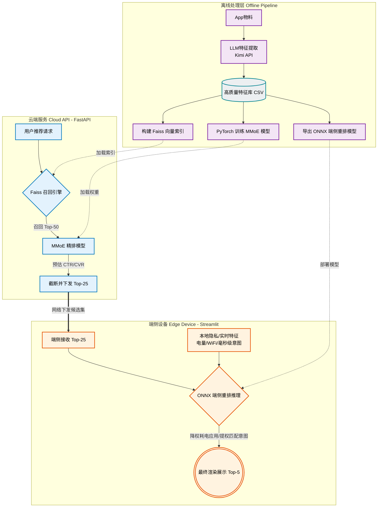

# 📱 工业级端云协同推荐系统 (Edge-Cloud Collaborative Recommendation System)


> **写在前面**：本项目是我为面试准备的核心 Demo，旨在展示对现代工业级推荐系统架构（召回 -> 粗排 -> 精排 -> 重排）的深刻理解，特别是前沿的**端云协同架构**以及**大模型（LLM）赋能特征工程**在真实场景中的应用落地。

## 🌟 背景与痛点

在传统的云端推荐系统中，用户的设备状态（如电量、网络环境）和极其短期的实时交互意图，往往因为**隐私合规限制**和**网络延迟**，无法被云端大模型及时获取。这导致系统容易在极端场景下给出不合理的推荐（例如：用户手机仅剩 5% 电量时，云端依然推荐了高耗电的重度游戏《原神》）。

本项目通过 **端云协同 (Edge-Cloud Collaboration)** 架构完美解决了这一痛点：
- **云端 (Cloud)**：负责吃算力的大规模向量召回 (Faiss) 和复杂的多任务深度学习预估 (MMoE)，下发粗筛后的候选集。
- **端侧 (Edge)**：负责吃隐私和实时性的轻量级重排 (ONNX)，利用本地的电量、网络、毫秒级交互意图进行最终洗牌。

## 🏗️ 系统架构图 (Architecture Diagram)



## 🛠️ 核心技术栈与亮点

1. **多任务学习 (MMoE)**：云端采用 MMoE (Multi-gate Mixture-of-Experts) 架构同时预估 CTR（点击率）和 CVR（转化率），有效解决多任务目标之间的跷跷板效应 (Seesaw Phenomenon)。
2. **端侧极速推理 (ONNX)**：将端侧重排逻辑导出为跨平台、无依赖的 ONNX 格式，仅依赖移动端 CPU 即可在毫秒级完成推理。摆脱了庞大的 PyTorch 依赖，极大地缩减了 App 体积。
3. **Faiss 向量召回**：采用工业级的高性能相似度搜索引擎 Faiss，极速从海量物料库中检索出 Top-N 候选集。
4. **大模型 (LLM) 赋能冷启动**：针对新 App 的冷启动问题，调用大语言模型（如 Kimi API）自动理解 App 的深层语义，提取高质量的标签并转化为特征向量。

---

## 🚀 快速启动体验

### 1. 环境准备
确保你已经安装了以下依赖（推荐使用 Conda 虚拟环境）：
```bash
pip install fastapi uvicorn requests streamlit pandas onnxruntime torch scikit-learn
```

### 2. 启动云端推荐引擎 (Cloud API)
打开第一个终端，启动云端服务：
```bash
python src/cloud_server.py
```
> 💡 **发生了什么？** 这将启动一个监听 8000 端口的 FastAPI 进程，加载训练好的 Faiss 索引和 MMoE 模型权重。它模拟了云端机房，接收请求、执行召回与精排，最终下发 Top-25 候选集。

### 3. 启动端侧模拟器 (Edge Demo)
打开第二个终端，启动可视化前端：
```bash
# Windows PowerShell 用户：
$env:STREAMLIT_SERVER_HEADLESS="true"; streamlit run src/app_demo.py

# Mac / Linux 用户：
STREAMLIT_SERVER_HEADLESS="true" streamlit run src/app_demo.py
```
> 💡 **发生了什么？** 浏览器将自动打开 `http://localhost:8501`。这模拟了用户的手机屏幕。

---

## 🎮 演示核心看点 (面试展示路径)

在打开的 Streamlit Web 页面中，你可以按照以下路径进行演示：
1. **观察左侧与中栏 (云端能力)**：左侧展示了云端 Faiss 召回的 50 个 App，中栏展示了云端 MMoE 精排下发的 Top-25 列表。其中通常会包含“王者荣耀”、“和平精英”等高得分的重度应用。
2. **模拟极端环境 (调整侧边栏)**：将**手机电量**拉低至 15% 以下，或将网络切换为 **4G**，并模拟用户最近点击了“工具/出行类”。
3. **观察右侧结果 (端侧重排)**：你会看到右侧的端侧 ONNX 模型**瞬间响应**，将重度游戏和高耗流视频 App 强力降权，而将轻量级工具/消除类 App 提权置顶。
4. **强调优势**：整个重排过程完全在本地（Edge）毫秒级完成，没有任何一次向云端发送诸如“电量低”等隐私数据的网络请求，做到了极致的隐私保护与实时性！

---

## 📁 项目结构深度解析

```text
📦 OPPO-Edge-Cloud-RecSys
 ├── 📂 data/
 │   └── 📄 app_features_enriched.csv  # 包含 50 款国民级 App 的高质量特征库 (LLM 丰富后)
 ├── 📂 models/
 │   ├── 📄 app_faiss.index            # Faiss 向量检索引擎
 │   ├── 📄 mmoe_trained.pt            # 云端多任务排序模型权重 (PyTorch)
 │   └── 📄 edge_reranker.onnx         # 端侧轻量级重排模型 (ONNX 格式)
 ├── 📂 src/
 │   ├── 📄 app_demo.py                # 端侧可视化交互页面 (Streamlit 前端)
 │   ├── 📄 cloud_server.py            # 云端推荐服务端 API (FastAPI 后端)
 │   ├── 📄 llm_feature_extractor.py   # 调用 LLM 提取冷启动语义特征
 │   ├── 📄 recall_faiss.py            # Faiss 召回模型的构建与推理逻辑
 │   ├── 📄 mmoe_model.py              # MMoE 模型网络结构定义 (Shared-Bottom + Experts)
 │   ├── 📄 train_mmoe.py              # MMoE 模型的真实训练 Pipeline (Dataset + 联合 Loss)
 │   └── 📄 edge_onnx_export.py        # 训练端侧模型并将其计算图导出为 ONNX 格式
 └── 📄 README.md                      # 项目说明文档
```

## 🧠 核心全链路 Pipeline (如何从零复现)

如果你想从头开始跑通整个模型训练链路（而非直接使用预训练好的模型），请按以下顺序执行脚本：

1. **特征准备**：配置好 API Key 后，运行 `python src/llm_feature_extractor.py` 利用大模型完善特征数据。
2. **构建召回**：运行 `python src/recall_faiss.py` 训练向量索引，生成 `models/app_faiss.index`。
3. **云端精排训练**：运行 `python src/train_mmoe.py`，联合优化 CTR 与 CVR，模型收敛后保存至 `models/mmoe_trained.pt`。
4. **端侧模型导出**：运行 `python src/edge_onnx_export.py`，将端侧基于特征交叉的重排逻辑固化为 `models/edge_reranker.onnx`。

---

## 🤝 总结与致谢

本项目通过一个微缩的“麻雀虽小，五脏俱全”的系统，打通了从底层大模型特征工程、云端 Faiss 召回、MMoE 精排，到端侧 ONNX 极速重排的全链路。非常适合在面试中作为核心实战项目展示。

欢迎交流探讨相关的推荐系统架构设计与模型细节！
